# MEDEVAC Technical Data Flow Model

## Request Flow Architecture

```mermaid
sequenceDiagram
    participant U as 👤 User
    participant SWA as 🌐 Static Web App
    participant F as ⚡ Azure Functions
    participant S as 💾 Blob Storage
    participant AI as 📊 App Insights
    
    Note over U,AI: MEDEVAC Form Loading Sequence
    
    U->>SWA: 1. Access MEDEVAC Form
    SWA->>U: 2. Serve React App (HTML/CSS/JS)
    
    U->>SWA: 3. Form Interaction (Select Location)
    SWA->>F: 4. GET /api/locations
    F->>AI: 5. Log Request
    F->>S: 6. Read country-locations.json
    S->>F: 7. Return JSON Data (1,081 records)
    F->>SWA: 8. Return Location Data
    SWA->>U: 9. Populate Dropdown
    
    Note over U,AI: Per Diem Calculation Sequence
    
    U->>SWA: 10. Select Location + Dates
    SWA->>F: 11. POST /api/perdiem {location, dates}
    F->>AI: 12. Log Calculation Request
    F->>S: 13. Check perdiem-cache/
    
    alt Cache Hit
        S->>F: 14a. Return Cached Rates
    else Cache Miss
        F->>F: 14b. Trigger Rate Scraping
        F->>S: 14c. Store New Rates
    end
    
    F->>F: 15. Calculate Per Diem Amount
    F->>SWA: 16. Return Calculated Amount
    SWA->>U: 17. Display Per Diem in Form
    
    Note over U,AI: Form Submission Sequence
    
    U->>SWA: 18. Submit Complete Form
    SWA->>F: 19. POST /api/medevac-form {formData}
    F->>AI: 20. Log Submission
    F->>F: 21. Validate Form Data
    F->>S: 22. Save to application-data/submissions/
    F->>AI: 23. Log Success/Error
    F->>SWA: 24. Return Confirmation
    SWA->>U: 25. Show Success Message
```



## Storage Data Model


## Function App Structure

```mermaid
graph LR
    subgraph "Azure Functions App: func-medevac-poc"
        subgraph "HTTP Triggers"
            A[GET /api/locations<br/>📍 Return location list]
            B[POST /api/perdiem<br/>💰 Calculate rates]
            C[POST /api/medevac-form<br/>📋 Submit form]
            D[GET /api/health<br/>❤️ Health check]
        end
        
        subgraph "Timer Triggers"
            E[Timer: Rate Updates<br/>🕒 Daily scraping]
            F[Timer: Cache Cleanup<br/>🗑️ Weekly maintenance]
        end
        
        subgraph "Shared Modules"
            G[Storage Helper<br/>💾 Blob operations]
            H[Validation Module<br/>✅ Data validation]
            I[Scraper Module<br/>🔍 Rate collection]
        end
    end
    
    A --> G
    B --> G
    B --> I
    C --> G
    C --> H
    E --> I
    E --> G
    F --> G
```



## Network Traffic Patterns

### Peak Usage Scenarios

1. **Form Loading Peak**
   - **When**: Business hours (9 AM - 5 PM EST)
   - **Pattern**: Static content served by CDN, location API called once per session
   - **Volume**: ~100-500 requests/hour
   - **Response Time**: <200ms

2. **Per Diem Calculation Peak**
   - **When**: Form completion times
   - **Pattern**: Multiple calculations as users refine selections
   - **Volume**: ~50-200 calculations/hour
   - **Response Time**: <500ms (cached), <2s (with scraping)

3. **Form Submission Peak**
   - **When**: End of business day, deadline periods
   - **Pattern**: Burst submissions followed by quiet periods
   - **Volume**: ~20-100 submissions/hour (peak), ~5/hour (average)
   - **Response Time**: <1s

### Background Processing


## Error Handling & Resilience

### Failure Modes & Recovery

1. **Function Cold Start**
   - **Issue**: 2-3 second delay on first request
   - **Mitigation**: Warm-up pings, keep-alive strategy
   - **Impact**: Minimal (user sees loading indicator)

2. **Storage Unavailability**
   - **Issue**: Blob storage temporarily unavailable
   - **Mitigation**: Retry logic, cached responses
   - **Impact**: Graceful degradation

3. **Rate Scraping Failure**
   - **Issue**: External API unavailable
   - **Mitigation**: Fallback to cached rates, manual override
   - **Impact**: Slightly outdated rates (acceptable for POC)

4. **High Load Scenarios**
   - **Issue**: Sudden traffic spike
   - **Mitigation**: Auto-scaling, CDN distribution
   - **Impact**: Automatic handling up to consumption limits

## Security Implementation

### Current Security Posture (POC)

```mermaid
graph LR
    subgraph "Security Layers"
        A[HTTPS Termination<br/>🔒 TLS 1.2+]
        B[CORS Policy<br/>🌐 Domain Restriction]
        C[Function Keys<br/>🔑 API Protection]
        D[Storage SAS<br/>📝 Limited Access]
    end
    
    subgraph "Future Security (Production)"
        E[Managed Identity<br/>🆔 Azure AD]
        F[Key Vault Integration<br/>🔐 Secret Management]
        G[API Gateway<br/>🚪 Rate Limiting]
        H[WAF Protection<br/>🛡️ Attack Prevention]
    end
    
    A --> E
    B --> G
    C --> F
    D --> E
```



## Monitoring Dashboard Design

### Key Performance Indicators

| Metric | Threshold | Action |
|--------|-----------|--------|
| Function Response Time | >2s average | Investigation |
| Error Rate | >5% | Alert admin |
| Storage Latency | >100ms | Check storage health |
| Form Submission Success | <95% | Immediate response |
| Daily Active Users | Trending | Capacity planning |

### Alert Configuration

```yaml
alerts:
  - name: "High Error Rate"
    condition: "error_rate > 5%"
    window: "5 minutes"
    action: "email + teams"
  
  - name: "Slow Response Time"  
    condition: "avg_response_time > 2000ms"
    window: "10 minutes"
    action: "email"
    
  - name: "Storage Issues"
    condition: "storage_errors > 10"
    window: "5 minutes"
    action: "email + teams"
```

---

This technical model provides a comprehensive view of how your Azure environment operates, from user interactions down to storage patterns and error handling mechanisms.