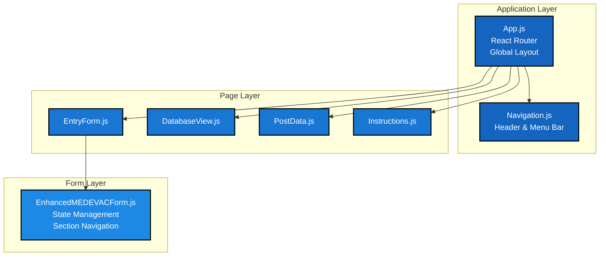
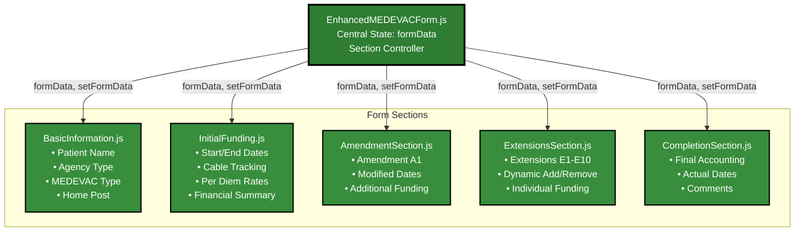
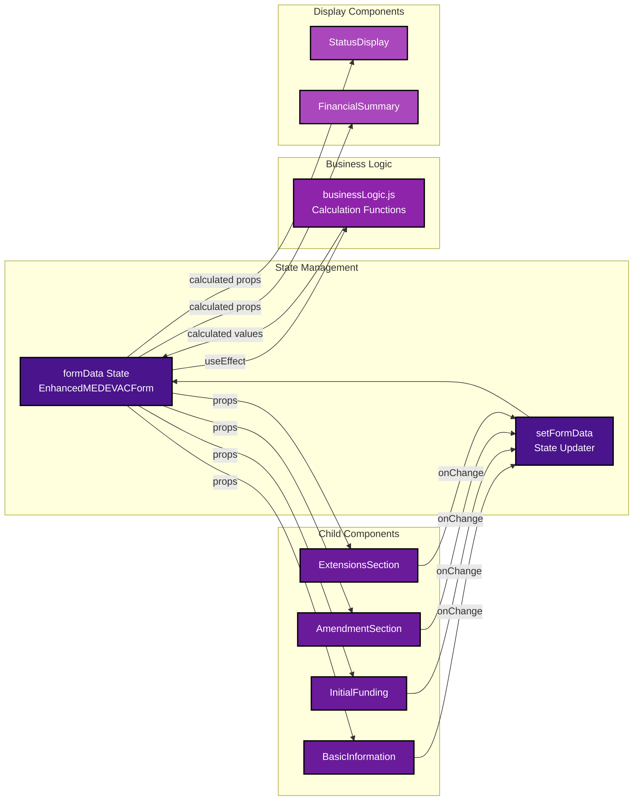
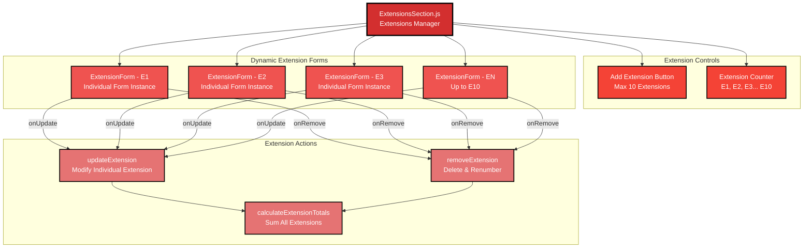
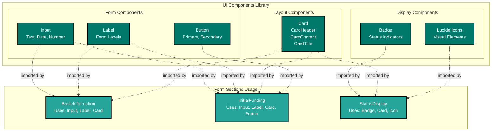

# MEDEVAC System Component Relationship Diagram

This diagram shows the React component hierarchy and relationships within the MEDEVAC form application.

## Component Hierarchy Diagram

```mermaid
flowchart TD
    %% Main App Structure
    APP[App.js<br/>Main Router & Layout]
    NAV[Navigation.js<br/>Header & Menu]
    
    %% Pages
    ENTRY[EntryForm.js<br/>Main Form Page]
    DB[DatabaseView.js<br/>Submissions List]
    POST[PostData.js<br/>Reference Data]
    INST[Instructions.js<br/>Help Content]
    
    %% Main Form Container
    ENHANCED[EnhancedMEDEVACForm.js<br/>Form State Manager<br/>& Section Controller]
    
    %% Form Sections
    BASIC[BasicInformation.js<br/>Patient & Case Info]
    FUNDING[InitialFunding.js<br/>Funding Container]
    AMEND[AmendmentSection.js<br/>A1 Amendment]
    EXT[ExtensionsSection.js<br/>E1-E10 Manager]
    COMP[CompletionSection.js<br/>Final Accounting]
    
    %% Basic Information Components
    STATUS[StatusDisplay.js<br/>Live Status & Totals]
    LOC[LocationFields.js<br/>Post & Region]
    
    %% Initial Funding Components
    CABLE[CableTracking.js<br/>Cable In/Out Dates]
    PERDIEM[PerDiemCalculator.js<br/>Rate Calculator]
    FINSUM[FinancialSummary.js<br/>Funding Overview]
    
    %% Extension Components
    EXTFORM[ExtensionForm<br/>Individual Extension<br/>(E1, E2, etc.)]
    
    %% UI Components
    CARD[Card Components<br/>CardHeader, CardContent]
    BUTTON[Button Components<br/>Primary, Secondary]
    INPUT[Input Components<br/>Text, Date, Number]
    LABEL[Label Components<br/>Form Labels]
    BADGE[Badge Components<br/>Status Indicators]
    
    %% Utility/Logic
    LOGIC[businessLogic.js<br/>Calculation Functions]
    
    %% Relationships
    APP --> NAV
    APP --> ENTRY
    APP --> DB
    APP --> POST
    APP --> INST
    
    ENTRY --> ENHANCED
    
    ENHANCED --> BASIC
    ENHANCED --> FUNDING
    ENHANCED --> AMEND
    ENHANCED --> EXT
    ENHANCED --> COMP
    
    BASIC --> STATUS
    BASIC --> LOC
    
    FUNDING --> CABLE
    FUNDING --> PERDIEM
    FUNDING --> FINSUM
    
    EXT --> EXTFORM
    
    %% UI Component Usage
    ENHANCED -.->|uses| CARD
    ENHANCED -.->|uses| BUTTON
    BASIC -.->|uses| INPUT
    BASIC -.->|uses| LABEL
    STATUS -.->|uses| BADGE
    FUNDING -.->|uses| CARD
    CABLE -.->|uses| INPUT
    PERDIEM -.->|uses| INPUT
    FINSUM -.->|uses| CARD
    AMEND -.->|uses| CARD
    AMEND -.->|uses| BUTTON
    EXT -.->|uses| CARD
    EXT -.->|uses| BUTTON
    EXTFORM -.->|uses| INPUT
    EXTFORM -.->|uses| LABEL
    COMP -.->|uses| CARD
    
    %% Business Logic Usage
    ENHANCED -.->|imports| LOGIC
    STATUS -.->|uses| LOGIC
    FINSUM -.->|uses| LOGIC
    
    %% Styling
    classDef app fill:#1a237e,color:#fff,stroke:#000,stroke-width:3px
    classDef page fill:#283593,color:#fff,stroke:#000,stroke-width:2px
    classDef main fill:#3949ab,color:#fff,stroke:#000,stroke-width:2px
    classDef section fill:#3f51b5,color:#fff,stroke:#000,stroke-width:2px
    classDef component fill:#5c6bc0,color:#fff,stroke:#000,stroke-width:1px
    classDef ui fill:#7986cb,color:#fff,stroke:#000,stroke-width:1px
    classDef utility fill:#9c27b0,color:#fff,stroke:#000,stroke-width:2px
    
    class APP app
    class NAV,ENTRY,DB,POST,INST page
    class ENHANCED main
    class BASIC,FUNDING,AMEND,EXT,COMP section
    class STATUS,LOC,CABLE,PERDIEM,FINSUM,EXTFORM component
    class CARD,BUTTON,INPUT,LABEL,BADGE ui
    class LOGIC utility
```

## Detailed Component Breakdown

### 1. Application Architecture


### 2. Form Section Architecture


### 3. Component Data Flow


### 4. Extension Management Architecture


### 5. UI Component Library Structure


## Component Responsibilities

### **EnhancedMEDEVACForm.js** - Master Controller
- **State Management**: Maintains complete formData state
- **Section Navigation**: Controls which section is displayed
- **Calculation Orchestration**: Triggers business logic calculations
- **Data Persistence**: Handles form submission to localStorage

### **Section Components** - Feature Modules
- **BasicInformation**: Patient info, agency type, post selection
- **InitialFunding**: Core funding data with per diem calculator
- **AmendmentSection**: Optional amendment (A1) with add/remove logic
- **ExtensionsSection**: Dynamic extension management (E1-E10)
- **CompletionSection**: Final accounting and comments

### **Specialized Components** - Focused Functionality
- **StatusDisplay**: Real-time status and financial summaries
- **LocationFields**: Post selection with automatic region lookup
- **CableTracking**: Cable in/out date management
- **PerDiemCalculator**: Multi-rate per diem calculations
- **FinancialSummary**: Comprehensive funding breakdowns

### **UI Components** - Reusable Elements
- **Card System**: Consistent layout containers
- **Form Controls**: Standardized inputs and labels
- **Status Indicators**: Badges and visual feedback
- **Icons**: Lucide icon system for visual enhancement

## Props Flow Pattern

### Standard Props Pattern
```javascript
// Parent to Child
<ChildComponent 
  formData={formData}
  setFormData={setFormData}
  // Additional specific props
/>

// Child Component
const ChildComponent = ({ formData, setFormData }) => {
  const handleChange = (field, value) => {
    setFormData(prev => ({
      ...prev,
      [field]: value
    }));
  };
};
```

### Extension Props Pattern
```javascript
// Extensions Manager
<ExtensionForm 
  extension={extension}
  onUpdate={(updatedExtension) => updateExtension(index, updatedExtension)}
  onRemove={() => removeExtension(index)}
  extensionNumber={index + 1}
/>
```

This component relationship diagram shows the clean separation of concerns, unidirectional data flow, and modular architecture that makes the MEDEVAC form system maintainable and scalable.