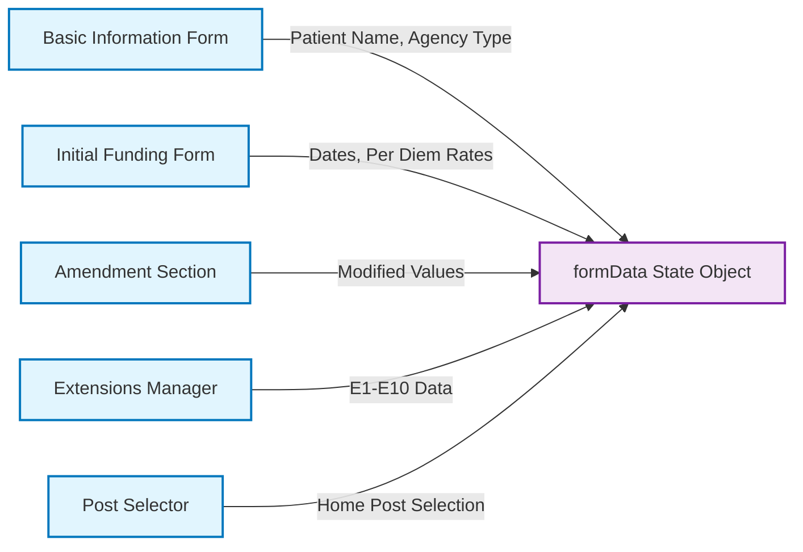
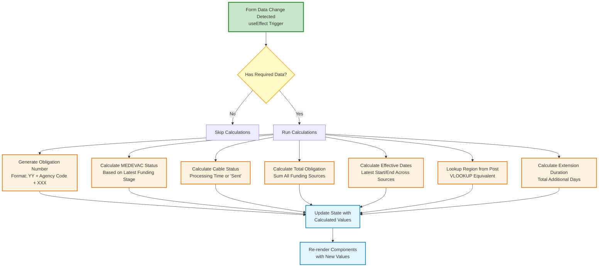
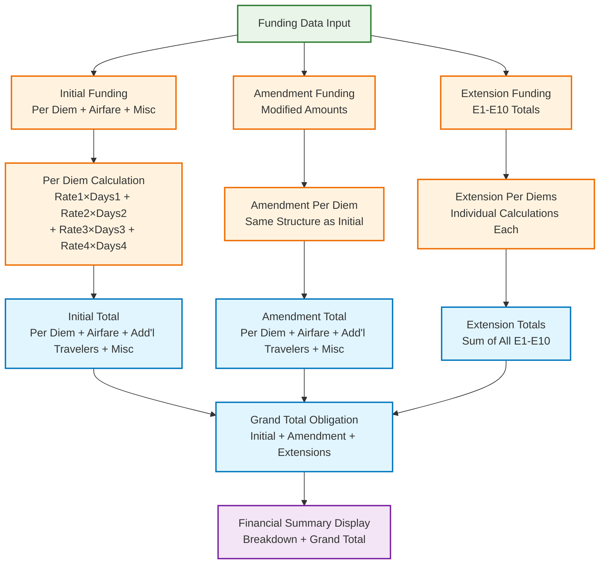
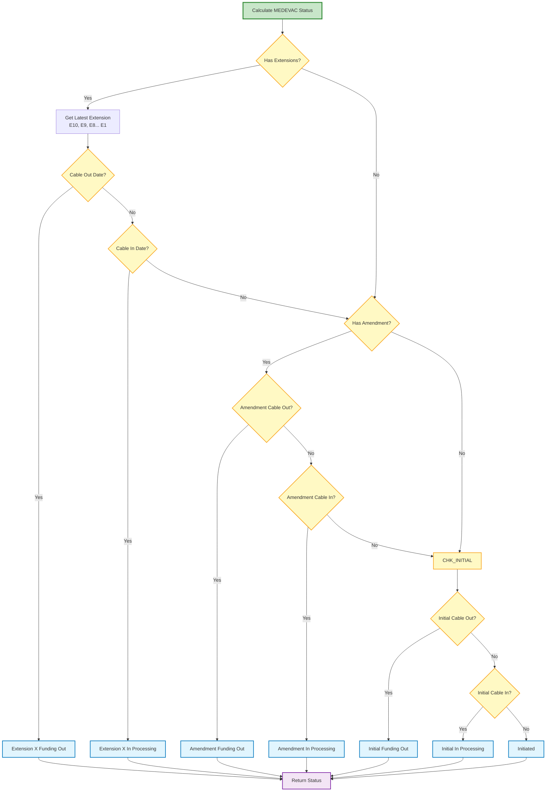
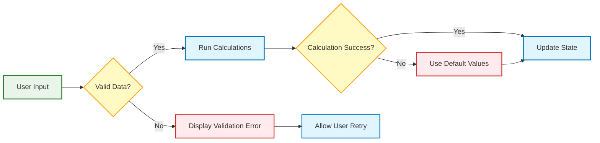

# MEDEVAC System Data Flow Diagram

This diagram shows how data flows through the MEDEVAC form system and how calculations are performed to replicate Excel tracker functionality.

## Data Flow Diagram

```mermaid
flowchart TD
    %% Input Sources
    UI[User Interface Inputs] 
    REF[Reference Data<br/>Post/Region Lookup]
    
    %% Core State
    STATE[React State<br/>formData Object]
    
    %% Business Logic Layer
    BL[Business Logic<br/>Calculations Engine]
    
    %% Calculation Functions
    CALC1[generateObligationNumber]
    CALC2[calculateMEDEVACStatus]
    CALC3[calculateCableStatus]
    CALC4[calculateTotalObligation]
    CALC5[calculateEffectiveDates]
    CALC6[getRegionFromPost]
    CALC7[calculateExtensionDuration]
    CALC8[calculateEmployeeResponseTime]
    
    %% Data Storage
    LOCAL[Local Storage<br/>Submissions]
    
    %% Display Components
    DISPLAY[Status Display<br/>Components]
    SUMMARY[Financial Summary<br/>Components]
    TRACKING[Cable Tracking<br/>Display]
    
    %% Data Flow
    UI -->|User Input| STATE
    REF -->|Post Selection| STATE
    
    STATE -->|Form Data Changes| BL
    
    BL --> CALC1
    BL --> CALC2
    BL --> CALC3
    BL --> CALC4
    BL --> CALC5
    BL --> CALC6
    BL --> CALC7
    BL --> CALC8
    
    %% Calculation Results Flow Back
    CALC1 -->|Obligation Number| STATE
    CALC2 -->|Status Updates| STATE
    CALC3 -->|Cable Status| STATE
    CALC4 -->|Financial Totals| STATE
    CALC5 -->|Effective Dates| STATE
    CALC6 -->|Region Assignment| STATE
    CALC7 -->|Duration Calcs| STATE
    CALC8 -->|Response Times| STATE
    
    %% Output to Components
    STATE -->|Calculated Values| DISPLAY
    STATE -->|Financial Data| SUMMARY
    STATE -->|Cable Status| TRACKING
    
    %% Persistence
    STATE -->|Form Submission| LOCAL
    
    %% Styling
    classDef input fill:#e1f5fe,stroke:#0277bd,stroke-width:2px
    classDef process fill:#f3e5f5,stroke:#7b1fa2,stroke-width:2px
    classDef calc fill:#fff3e0,stroke:#ef6c00,stroke-width:2px
    classDef output fill:#e8f5e8,stroke:#2e7d32,stroke-width:2px
    classDef storage fill:#fce4ec,stroke:#c2185b,stroke-width:2px
    
    class UI,REF input
    class STATE,BL process
    class CALC1,CALC2,CALC3,CALC4,CALC5,CALC6,CALC7,CALC8 calc
    class DISPLAY,SUMMARY,TRACKING output
    class LOCAL storage
```

## Detailed Data Flow Process

### 1. Input Layer

### 2. Calculation Engine Flow

### 3. Financial Calculation Flow

### 4. Status Calculation Logic

## Data Flow Patterns

### Real-time Calculation Pattern
1. **User Input** → Form field change
2. **State Update** → formData modified via setFormData
3. **useEffect Trigger** → Dependency array detects change
4. **Calculation Execution** → Business logic functions run
5. **State Update** → Calculated values merged into formData
6. **Component Re-render** → UI displays updated values

### Excel Equivalency Pattern
The system replicates Excel's calculation model:
- **Immediate Updates**: Like Excel cells, changes trigger immediate recalculation
- **Dependency Chain**: Changes cascade through related calculations
- **VLOOKUP Simulation**: Post selection triggers region lookup
- **Formula Replication**: Status, totals, and dates calculated using Excel logic

### Error Handling Flow

This data flow diagram illustrates how the MEDEVAC system processes user input, performs Excel-equivalent calculations, and maintains real-time updates across all components while ensuring data consistency and accuracy.