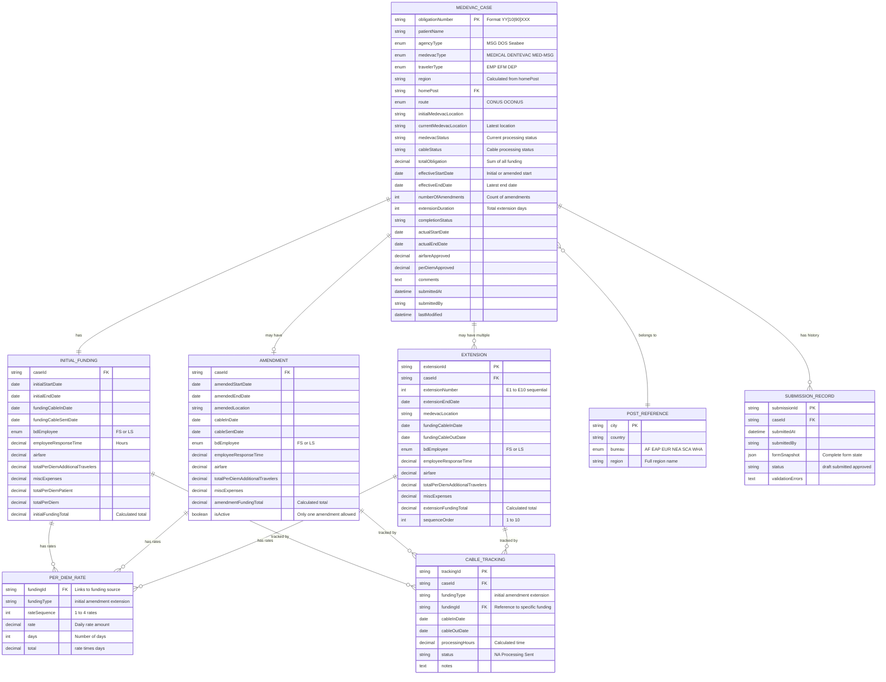

# MEDEVAC Form Entity Relationship Diagram (ERD)

Based on the React application structure and data models, this ERD represents the logical data structure used in the MEDEVAC form system.

## Entity Relationship Diagram



## Entity Descriptions

### MEDEVAC_CASE
The primary entity representing a medical evacuation case. Contains core patient and case information, plus calculated fields that replicate Excel tracker functionality.

**Key Business Rules:**
- Obligation Number follows format: YY[10|90]XXX (fiscal year + agency code + sequence)
- Agency code: 10 for DOS/Seabee, 90 for MSG
- Status fields are calculated based on latest funding activity
- Only one amendment per case allowed
- Up to 10 extensions (E1-E10) allowed

### INITIAL_FUNDING
Core funding information for the initial MEDEVAC authorization. Every case must have initial funding.

**Key Business Rules:**
- Required for all cases
- Contains primary per diem rates (up to 4 different rates)
- Cable tracking for funding approval process
- Employee response time calculated in hours

### AMENDMENT
Optional modification to initial funding. Limited to one per case (A1).

**Key Business Rules:**
- Maximum one amendment per case
- Can modify dates, location, and funding amounts
- Inherits structure similar to initial funding
- Affects effective start/end dates calculation

### EXTENSION
Additional funding periods beyond initial authorization. Up to 10 extensions allowed (E1-E10).

**Key Business Rules:**
- Sequential numbering (E1, E2, ..., E10)
- Each extension extends the effective end date
- Independent per diem rates and funding calculations
- Automatic renumbering when extensions are removed

### PER_DIEM_RATE
Flexible per diem structure supporting up to 4 different daily rates per funding source.

**Key Business Rules:**
- Links to initial funding, amendment, or specific extension
- Supports variable rates for different time periods
- Automatic total calculation (rate × days)
- Up to 4 rates per funding source

### POST_REFERENCE
Reference data for diplomatic posts worldwide, supporting regional lookups.

**Key Features:**
- 400+ diplomatic posts across 6 regional bureaus
- Automatic region calculation based on post selection
- Supports VLOOKUP equivalent functionality from Excel

### CABLE_TRACKING
Tracks funding cable processing through the approval workflow.

**Key Features:**
- Links to any funding source (initial, amendment, extension)
- Calculates processing time in hours
- Status tracking (N/A, Processing, Sent)
- Employee response time calculations

### SUBMISSION_RECORD
Audit trail for form submissions and state changes.

**Key Features:**
- Complete form state snapshot in JSON
- Submission history tracking
- Validation error logging
- Status progression tracking

## Calculated Fields & Business Logic

The ERD supports Excel-equivalent calculations through the following computed fields:

### Status Calculations
- **MEDEVAC Status**: Based on latest funding stage (Initial → Amendment → Extensions)
- **Cable Status**: Processing time or "Sent" status
- **Total Obligation**: Sum of initial + amendment + all extensions

### Date Calculations
- **Effective Start Date**: Initial or amended start date
- **Effective End Date**: Latest end date across all funding sources
- **Extension Duration**: Total additional days beyond initial authorization

### Financial Calculations
- **Per Diem Totals**: Sum of (rate × days) for each funding source
- **Funding Totals**: Per diem + airfare + additional travelers + misc expenses
- **Total Obligation**: Grand sum of all funding sources

## Data Relationships

### One-to-One Relationships
- MEDEVAC_CASE ↔ INITIAL_FUNDING (required)
- MEDEVAC_CASE ↔ AMENDMENT (optional, max 1)

### One-to-Many Relationships
- MEDEVAC_CASE → EXTENSION (0 to 10)
- MEDEVAC_CASE → SUBMISSION_RECORD (audit trail)
- FUNDING_SOURCE → PER_DIEM_RATE (up to 4 rates each)
- FUNDING_SOURCE → CABLE_TRACKING (processing history)

### Many-to-One Relationships
- MEDEVAC_CASE → POST_REFERENCE (regional lookup)

## Implementation Notes

### React State Structure
The ERD reflects the actual React state structure used in the application:
```javascript
formData: {
  // MEDEVAC_CASE fields
  obligationNumber, patientName, agencyType, etc.
  
  // INITIAL_FUNDING embedded
  initialStartDate, initialEndDate, airfare, etc.
  
  // PER_DIEM_RATE as array
  perDiemRates: [{ rate, days, id }, ...],
  
  // AMENDMENT as optional object
  amendment: { amendedStartDate, ... } | null,
  
  // EXTENSION as array
  extensions: [{ extensionNumber, extensionEndDate, ... }],
  
  // Calculated fields
  medevacStatus, totalObligation, etc.
}
```

### Database Implementation Considerations
For a production database implementation, consider:
- **Normalization**: Separate tables for each entity
- **Indexing**: On obligationNumber, caseId, homePost
- **Constraints**: Foreign keys, check constraints for enums
- **Triggers**: For automatic calculation updates
- **Views**: For Excel-equivalent summary reports

This ERD provides a comprehensive foundation for understanding the data structure and relationships in the MEDEVAC form system, supporting both the current React implementation and future database migrations.