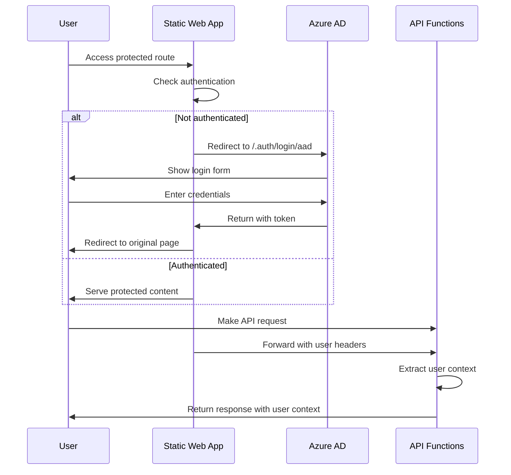

# MEDEVAC Authentication System Documentation

## Overview

The MEDEVAC application uses Azure Static Web Apps' built-in authentication system to provide secure access control for State Department personnel. This system integrates seamlessly with Azure Active Directory and provides role-based access control.

## Authentication Flow



## Configuration

### Static Web App Configuration (`staticwebapp.config.json`)

```json
{
  "routes": [
    {
      "route": "/login",
      "redirect": "/.auth/login/aad"
    },
    {
      "route": "/logout",
      "redirect": "/.auth/logout"
    },
    {
      "route": "/api/*",
      "allowedRoles": ["authenticated"]
    },
    {
      "route": "/*",
      "allowedRoles": ["authenticated"]
    }
  ],
  "auth": {
    "identityProviders": {
      "azureActiveDirectory": {
        "userDetailsClaim": "http://schemas.xmlsoap.org/ws/2005/05/identity/claims/name",
        "registration": {
          "openIdIssuer": "https://login.microsoftonline.com/common/v2.0",
          "clientIdSettingName": "AZURE_CLIENT_ID",
          "clientSecretSettingName": "AZURE_CLIENT_SECRET"
        }
      }
    }
  }
}
```

### Required Environment Variables

Set these in the Azure Static Web Apps configuration:

- `AZURE_CLIENT_ID`: Azure AD application client ID
- `AZURE_CLIENT_SECRET`: Azure AD application client secret

## Authentication Components

### AuthContext (`src/contexts/AuthContext.js`)

The main authentication context that manages user state and provides authentication functions.

**Key Features:**
- Checks authentication status via `/.auth/me` endpoint
- Manages user profile information
- Provides login/logout functions
- Supports multiple identity providers

**Usage:**
```javascript
import { useAuth } from '../contexts/AuthContext';

const { user, isAuthenticated, login, logout } = useAuth();
```

### ProtectedRoute (`src/components/ProtectedRoute.jsx`)

A wrapper component that enforces authentication requirements on routes.

**Features:**
- Redirects unauthenticated users to login
- Supports role-based access control
- Shows loading states during auth checks
- Handles access denied scenarios

**Usage:**
```javascript
<ProtectedRoute requiredRoles={['authenticated']}>
  <YourComponent />
</ProtectedRoute>
```

### LoginPage (`src/components/LoginPage.jsx`)

Professional login interface with State Department branding.

**Features:**
- Azure AD primary authentication
- Secondary providers (GitHub, Google) if configured
- Government-appropriate styling
- Clear security messaging

## User Context in API Functions

API functions automatically receive user context through Azure Static Web Apps headers.

### User Information Extraction

```javascript
const userHeader = req.headers['x-ms-client-principal'];
let userInfo = null;
if (userHeader) {
    try {
        const decoded = Buffer.from(userHeader, 'base64').toString('ascii');
        userInfo = JSON.parse(decoded);
    } catch (e) {
        context.log('Could not parse user info:', e);
    }
}
```

### User Context Structure

```javascript
{
  userId: "unique-user-id",
  userDetails: "user@state.gov",
  identityProvider: "aad",
  userRoles: ["authenticated"]
}
```

## Security Features

### Route Protection

All routes except `/login` require authentication:

- **Unauthenticated Access**: Automatically redirected to login
- **API Endpoints**: Protected with `authenticated` role requirement
- **Static Content**: Served only to authenticated users

### User Tracking

All MEDEVAC submissions include user context:

```javascript
{
  // ... form data
  createdBy: {
    userId: "user-id",
    userDetails: "user@state.gov",
    identityProvider: "aad"
  },
  createdAt: "2025-12-03T20:00:00.000Z"
}
```

### Role-Based Access Control

The system supports role-based access control through Azure AD groups:

```javascript
// Check if user has specific role
const hasRole = user.roles.includes('medevac-admin');

// Protect routes with specific roles
<ProtectedRoute requiredRoles={['medevac-admin']}>
  <AdminPanel />
</ProtectedRoute>
```

## Built-in Endpoints

Azure Static Web Apps provides these authentication endpoints:

- `/.auth/login/aad` - Azure AD login
- `/.auth/login/github` - GitHub login (if configured)
- `/.auth/login/google` - Google login (if configured)
- `/.auth/logout` - Logout from all providers
- `/.auth/me` - Get current user information

## Navigation Integration

The navigation component shows user information and logout functionality:

**Desktop Navigation:**
- User name/email display
- Logout button
- Theme toggle

**Mobile Navigation:**
- Responsive user menu
- Consistent logout access

## Development vs Production

### Development
- Uses Azure AD common endpoint for testing
- Supports multiple identity providers for flexibility
- Debug logging enabled

### Production
- Should use specific tenant ID in `openIdIssuer`
- Azure AD only for security
- Minimal logging for performance

## Troubleshooting

### Common Issues

1. **"Not authenticated" errors**
   - Check if user is logged in via `/.auth/me`
   - Verify Static Web Apps authentication is enabled
   - Ensure Azure AD app registration is correct

2. **Redirect loops**
   - Check `staticwebapp.config.json` route configuration
   - Verify login redirect URLs match app registration

3. **API authentication failures**
   - Check `x-ms-client-principal` header in API functions
   - Verify API routes have correct `allowedRoles`

### Debug User Authentication

```javascript
// In browser console
fetch('/.auth/me')
  .then(r => r.json())
  .then(console.log);
```

### API Debug Headers

```javascript
// In API function
context.log('Auth headers:', {
  principal: req.headers['x-ms-client-principal'],
  originalUrl: req.headers['x-original-url']
});
```

## Best Practices

1. **Always use HTTPS** in production
2. **Validate user roles** in API functions
3. **Log authentication events** for audit trails
4. **Handle authentication errors** gracefully
5. **Test with different user roles** before deployment

## Azure AD App Registration

For production deployment, register an Azure AD application:

1. Go to Azure Portal > Azure Active Directory > App registrations
2. Create new registration for MEDEVAC app
3. Configure redirect URIs for Static Web Apps domain
4. Generate client secret
5. Set environment variables in Static Web Apps

**Redirect URIs:**
- `https://your-app.azurestaticapps.net/.auth/login/aad/callback`

This authentication system ensures secure access to the MEDEVAC application while maintaining government security standards and user accountability.