# Azure Solution Architecture
## MEDEVAC Form Application with State Department Integration

### Executive Summary

This document outlines a comprehensive Azure cloud architecture for hosting the MEDEVAC Form Application, a React-based frontend with Node.js/Express backend that integrates with U.S. State Department systems for real-time per diem rate scraping.

### Architecture Overview

```mermaid
graph TB
    subgraph "Internet"
        Users[👥 Users]
        StateDept[🏛️ State Department<br/>allowances.state.gov]
    end

    subgraph "Azure Cloud Platform"
        subgraph "Frontend Tier"
            CDN[Azure CDN]
            StaticWeb[Azure Static Web Apps<br/>React Frontend]
        end

        subgraph "Application Tier"
            AppService[Azure App Service<br/>Node.js Backend API]
            FunctionApp[Azure Functions<br/>Scraper Service]
        end

        subgraph "Data Tier"
            BlobStorage[Azure Blob Storage<br/>Per Diem Cache & Logs]
        end

        subgraph "Security & Monitoring"
            KeyVault[Azure Key Vault<br/>Secrets Management]
            AppInsights[Application Insights<br/>Monitoring & Telemetry]
            LogAnalytics[Log Analytics<br/>Centralized Logging]
        end

        subgraph "Networking"
            VNet[Azure Virtual Network]
            PrivateEndpoints[Private Endpoints]
        end
    end

    Users --> CDN
    CDN --> StaticWeb
    StaticWeb --> AppService
    AppService --> FunctionApp
    FunctionApp --> StateDept
    FunctionApp --> BlobStorage
    AppService --> BlobStorage
    AppService --> KeyVault
    FunctionApp --> KeyVault
    AppService --> AppInsights
    FunctionApp --> AppInsights
    AppInsights --> LogAnalytics
```



## Detailed Component Architecture

### 1. Frontend Layer

#### Azure Static Web Apps
- **Service**: Azure Static Web Apps (Standard Tier)
- **Purpose**: Host React frontend application
- **Features**:
  - Built-in CI/CD from GitHub
  - Custom domains with SSL
  - Global CDN distribution
  - Staging environments
  - Authentication integration

**Configuration**:
```json
{
  "staticwebapp.config.json": {
    "routes": [
      {
        "route": "/api/*",
        "rewrite": "https://medevac-api.azurewebsites.net/api/*"
      },
      {
        "route": "/*",
        "serve": "/index.html",
        "statusCode": 200
      }
    ],
    "responseOverrides": {
      "404": {
        "rewrite": "/index.html"
      }
    }
  }
}
```

#### Azure CDN
- **Service**: Azure CDN Premium (Verizon)
- **Purpose**: Global content delivery and caching
- **Benefits**:
  - Reduced latency worldwide
  - DDoS protection
  - Custom caching rules
  - Compression and optimization

### 2. Backend API Layer

#### Azure App Service
- **Service**: Azure App Service (Premium P1V3)
- **Runtime**: Node.js 18 LTS
- **Purpose**: Main API backend for form operations
- **Features**:
  - Auto-scaling capabilities
  - Deployment slots (staging/production)
  - Integrated monitoring
  - Custom domains and SSL

**App Service Configuration**:
```javascript
// Configuration for Azure App Service
module.exports = {
  port: process.env.PORT || 8080,
  cors: {
    origin: process.env.FRONTEND_URL || 'https://medevac-app.azurestaticapps.net',
    credentials: true
  },
  storage: {
    connectionString: process.env.AZURE_STORAGE_CONNECTION_STRING,
    containerName: process.env.STORAGE_CONTAINER_NAME || 'perdiem-cache'
  },
  keyVault: {
    url: process.env.KEY_VAULT_URL
  }
};
```

### 3. Scraper Service Layer

#### Azure Functions
- **Service**: Azure Functions Premium Plan
- **Runtime**: Node.js 18
- **Purpose**: State Department data scraping service
- **Triggers**:
  - HTTP triggers for on-demand scraping
  - Timer triggers for scheduled updates
  - Queue triggers for batch processing

**Function Configuration**:
```javascript
// Azure Function for State Department scraping
const { BlobServiceClient } = require('@azure/storage-blob');

module.exports = async function (context, req) {
    const { locationCode } = req.params;
    
    try {
        // Initialize Blob Storage client
        const blobServiceClient = BlobServiceClient.fromConnectionString(
            process.env.AZURE_STORAGE_CONNECTION_STRING
        );
        const containerClient = blobServiceClient.getContainerClient('perdiem-cache');
        
        // Retrieve secrets from Key Vault
        const credentials = await getKeyVaultSecrets();
        
        // Scrape State Department data
        const perDiemData = await scrapeStateDepartment(locationCode, credentials);
        
        // Cache in Blob Storage as JSON
        const blobName = `location-${locationCode}-${new Date().toISOString().split('T')[0]}.json`;
        const blockBlobClient = containerClient.getBlockBlobClient(blobName);
        await blockBlobClient.upload(JSON.stringify(perDiemData), JSON.stringify(perDiemData).length);
        
        // Log to Application Insights
        context.log('Successfully scraped location:', locationCode);
        
        context.res = {
            status: 200,
            body: perDiemData
        };
    } catch (error) {
        context.log.error('Scraping failed:', error);
        context.res = {
            status: 500,
            body: { error: 'Scraping service unavailable' }
        };
    }
};
```

### 4. Data Layer

#### Azure Blob Storage
- **Service**: Azure Blob Storage (Hot tier)
- **Purpose**: Primary data storage for per diem rates, cache, and logs
- **Containers**:
  - `perdiem-cache`: Current per diem rate cache (JSON files)
  - `rate-history`: Historical per diem rates
  - `scraper-logs`: Detailed scraping logs
  - `application-data`: Form submissions and user data

**Data Structure**:
```javascript
// Blob Storage JSON file structure
// File: perdiem-cache/location-11410-2024-11-25.json
{
  "locationCode": "11410",
  "country": "Austria",
  "post": "Linz",
  "rates": [
    {
      "seasonBegin": "01/01",
      "seasonEnd": "12/31",
      "maxLodging": 245,
      "mieRate": 100,
      "maxPerDiem": 345,
      "effectiveDate": "2024-01-01"
    }
  ],
  "lastUpdated": "2024-11-25T10:30:00Z",
  "cacheExpiry": "2024-11-26T10:30:00Z",
  "source": "state-dept-official"
}
```

**Storage Features**:
- **Redundancy**: Geo-redundant storage (GRS) for data protection
- **Access Tiers**: Hot tier for frequently accessed cache data
- **Lifecycle Management**: Automatic archiving of old data
- **Security**: Private endpoints and access key rotation

### 5. Security Layer

#### Azure Key Vault
- **Service**: Azure Key Vault Standard
- **Purpose**: Secure secrets management
- **Stored Secrets**:
  - Cosmos DB connection strings
  - State Department session tokens
  - Application API keys
  - SSL certificates

#### Azure Active Directory
- **Service**: Azure AD B2C (optional for user management)
- **Purpose**: User authentication and authorization
- **Features**:
  - Multi-factor authentication
  - Role-based access control
  - Social login integration

### 6. Monitoring & Observability

#### Application Insights
- **Service**: Application Insights
- **Purpose**: Application performance monitoring
- **Features**:
  - Real-time performance metrics
  - Custom dashboards
  - Automated alerts
  - Dependency tracking

**Custom Metrics**:
```javascript
// Application Insights integration
const appInsights = require('applicationinsights');
appInsights.setup(process.env.APPINSIGHTS_INSTRUMENTATIONKEY);

// Custom metrics for scraping success rate
appInsights.defaultClient.trackMetric({
  name: 'StateDeptScrapingSuccessRate',
  value: successRate,
  properties: {
    locationCode: locationCode,
    timestamp: new Date()
  }
});
```

#### Log Analytics
- **Service**: Azure Monitor Log Analytics
- **Purpose**: Centralized logging and analysis
- **Log Types**:
  - Application logs
  - Performance metrics
  - Security audit logs
  - Custom events

## Deployment Strategy

### 1. Infrastructure as Code

#### ARM Template
```json
{
  "$schema": "https://schema.management.azure.com/schemas/2019-04-01/deploymentTemplate.json#",
  "contentVersion": "1.0.0.0",
  "parameters": {
    "appName": {
      "type": "string",
      "defaultValue": "medevac-app"
    },
    "environment": {
      "type": "string",
      "defaultValue": "prod",
      "allowedValues": ["dev", "staging", "prod"]
    }
  },
  "variables": {
    "resourcePrefix": "[concat(parameters('appName'), '-', parameters('environment'))]"
  },
  "resources": [
    {
      "type": "Microsoft.Web/sites",
      "apiVersion": "2021-02-01",
      "name": "[concat(variables('resourcePrefix'), '-api')]",
      "location": "[resourceGroup().location]",
      "kind": "app,linux",
      "properties": {
        "serverFarmId": "[resourceId('Microsoft.Web/serverfarms', concat(variables('resourcePrefix'), '-plan'))]",
        "siteConfig": {
          "linuxFxVersion": "NODE|18-lts",
          "appSettings": [
            {
              "name": "AZURE_STORAGE_CONNECTION_STRING",
              "value": "[concat('DefaultEndpointsProtocol=https;AccountName=', concat(variables('resourcePrefix'), 'storage'), ';AccountKey=', listKeys(resourceId('Microsoft.Storage/storageAccounts', concat(variables('resourcePrefix'), 'storage')), '2021-04-01').keys[0].value)]"
            }
          ]
        }
      }
    }
  ]
}
```

### 2. CI/CD Pipeline

#### GitHub Actions Workflow
```yaml
name: Deploy MEDEVAC Application

on:
  push:
    branches: [ main ]

jobs:
  deploy-frontend:
    runs-on: ubuntu-latest
    steps:
      - uses: actions/checkout@v3
      - name: Setup Node.js
        uses: actions/setup-node@v3
        with:
          node-version: '18'
      - name: Install and build
        run: |
          npm ci
          npm run build
      - name: Deploy to Azure Static Web Apps
        uses: Azure/static-web-apps-deploy@v1
        with:
          azure_static_web_apps_api_token: ${{ secrets.AZURE_STATIC_WEB_APPS_API_TOKEN }}
          repo_token: ${{ secrets.GITHUB_TOKEN }}
          action: "upload"
          app_location: "/"
          output_location: "build"

  deploy-backend:
    runs-on: ubuntu-latest
    steps:
      - uses: actions/checkout@v3
      - name: Deploy to Azure App Service
        uses: azure/webapps-deploy@v2
        with:
          app-name: 'medevac-app-api'
          publish-profile: ${{ secrets.AZURE_WEBAPP_PUBLISH_PROFILE }}
          package: './server'
```

## Resource Sizing & Cost Estimation

### 💻 **Compute Resources**
| Service | Configuration | Specifications | Monthly Cost |
|---------|--------------|----------------|-------------|
| **Azure Static Web Apps** | Standard Plan | • Custom domains<br/>• Authentication<br/>• Functions integration | **$9.00** |
| **Azure App Service** | Premium P1V3 | • 2 vCPU, 8GB RAM<br/>• Auto-scaling enabled<br/>• Deployment slots | **$146.00** |
| **Azure Functions** | Premium EP1 | • 1 vCPU, 3.5GB RAM<br/>• Pre-warmed instances<br/>• VNet integration | **$73.00** |
| | | **Compute Subtotal** | **$228.00** |

### 💾 **Storage & Data Services**
| Service | Configuration | Capacity & Features | Monthly Cost |
|---------|--------------|-------------------|-------------|
| **Blob Storage** | Hot Tier + GRS | • 500GB storage<br/>• Geo-redundant replication<br/>• Lifecycle management | **$25.00** |
| | | **Storage Subtotal** | **$25.00** |

### 🔒 **Security & Monitoring**
| Service | Configuration | Features | Monthly Cost |
|---------|--------------|----------|-------------|
| **Application Insights** | Standard | • Performance monitoring<br/>• Error tracking<br/>• Custom metrics | **$5.00** |
| **Azure Key Vault** | Standard | • Secret management<br/>• SSL certificates<br/>• Hardware security | **$3.00** |
| **Log Analytics** | 5GB/month | • Centralized logging<br/>• Query capabilities<br/>• Retention policies | **$2.00** |
| | | **Monitoring Subtotal** | **$10.00** |

---

### 📊 **Cost Summary**
```
🖥️  Compute Resources:     $228.00/month
💾  Storage & Data:         $25.00/month  
🔒  Security & Monitoring:  $10.00/month
━━━━━━━━━━━━━━━━━━━━━━━━━━━━━━━━━━━━━━━━━━━
💰  TOTAL MONTHLY COST:    $263.00/month
```

### 📈 **Scaling Considerations**
- **Low Usage** (< 1,000 users): ~$180/month (downgrade App Service to P1V2)
- **Current Estimate** (1,000-5,000 users): ~$263/month  
- **High Usage** (5,000+ users): ~$400/month (upgrade to P2V3 + additional Functions)

### 💡 **Cost Optimization Opportunities**
- **Reserved Instances**: Save 30-40% with 1-year commitments
- **Dev/Test Environments**: Use consumption-based Functions for staging
- **Storage Lifecycle**: Automatic archival of old per diem data
- **Monitoring**: Free tier covers development environments

## Security Considerations

### 1. Network Security
- Private endpoints for database connections
- Virtual network integration
- Web Application Firewall (WAF)
- DDoS protection

### 2. Data Security
- Encryption at rest and in transit
- Managed identity authentication
- Key Vault for secrets management
- Regular security audits

### 3. Application Security
- HTTPS enforcement
- CORS configuration
- Input validation and sanitization
- Rate limiting and throttling

## Performance Optimization

### 1. Caching Strategy
```javascript
// Blob Storage-based caching implementation
const { BlobServiceClient } = require('@azure/storage-blob');

class CacheManager {
  constructor() {
    this.memoryCache = new Map();
    this.blobServiceClient = BlobServiceClient.fromConnectionString(
      process.env.AZURE_STORAGE_CONNECTION_STRING
    );
    this.containerClient = this.blobServiceClient.getContainerClient('perdiem-cache');
  }

  async getPerDiem(locationCode) {
    // 1. Check memory cache (fastest)
    if (this.memoryCache.has(locationCode)) {
      return this.memoryCache.get(locationCode);
    }

    // 2. Check Blob Storage cache (moderate speed)
    const blobData = await this.getBlobCache(locationCode);
    if (blobData && !this.isExpired(blobData)) {
      this.memoryCache.set(locationCode, blobData);
      return blobData;
    }

    // 3. Scrape fresh data (slow)
    const freshData = await this.scrapeStateDepartment(locationCode);
    await this.setBlobCache(locationCode, freshData);
    this.memoryCache.set(locationCode, freshData);
    
    return freshData;
  }

  async getBlobCache(locationCode) {
    try {
      const blobName = `location-${locationCode}-${new Date().toISOString().split('T')[0]}.json`;
      const blockBlobClient = this.containerClient.getBlockBlobClient(blobName);
      const downloadResponse = await blockBlobClient.download(0);
      const data = await this.streamToString(downloadResponse.readableStreamBody);
      return JSON.parse(data);
    } catch (error) {
      return null; // Cache miss
    }
  }

  async setBlobCache(locationCode, data) {
    const blobName = `location-${locationCode}-${new Date().toISOString().split('T')[0]}.json`;
    const blockBlobClient = this.containerClient.getBlockBlobClient(blobName);
    const dataString = JSON.stringify(data);
    await blockBlobClient.upload(dataString, dataString.length);
  }
}
```

### 2. Auto-scaling Configuration
```javascript
// Azure App Service auto-scaling rules
{
  "enabled": true,
  "profiles": [
    {
      "name": "Default",
      "capacity": {
        "minimum": "1",
        "maximum": "10",
        "default": "2"
      },
      "rules": [
        {
          "metricTrigger": {
            "metricName": "CpuPercentage",
            "threshold": 70,
            "operator": "GreaterThan"
          },
          "scaleAction": {
            "direction": "Increase",
            "type": "ChangeCount",
            "value": "1",
            "cooldown": "PT5M"
          }
        }
      ]
    }
  ]
}
```

## Disaster Recovery

### 1. Backup Strategy
- **Blob Storage**: Geo-redundant storage (GRS) with automated backup
- **Point-in-time recovery**: 30-day retention for critical data
- **Application**: Source code in GitHub with multiple environments
- **Data Export**: Daily exports of cache data to long-term storage

### 2. Recovery Procedures
- **RTO (Recovery Time Objective)**: 1 hour
- **RPO (Recovery Point Objective)**: 15 minutes
- **Multi-region deployment** for critical applications

## Implementation Roadmap

### Phase 1: Foundation (Week 1-2)
- [ ] Azure resource provisioning
- [ ] Basic CI/CD pipeline setup
- [ ] Frontend deployment to Static Web Apps
- [ ] Backend deployment to App Service

### Phase 2: Integration (Week 3-4)
- [ ] Cosmos DB integration
- [ ] Key Vault implementation
- [ ] Application Insights setup
- [ ] Basic monitoring dashboards

### Phase 3: Optimization (Week 5-6)
- [ ] Performance tuning
- [ ] Advanced caching implementation
- [ ] Auto-scaling configuration
- [ ] Security hardening

### Phase 4: Production (Week 7-8)
- [ ] Load testing
- [ ] Security penetration testing
- [ ] Documentation completion
- [ ] Go-live procedures

## Migration Strategy

### 1. Data Migration
```bash
# Migrate existing cache data to Blob Storage
npm run migrate-to-blob --source=./server/cache --target=blob-storage

# Upload existing cache files
az storage blob upload-batch --destination perdiem-cache --source ./server/cache

# Backup existing configuration
npm run backup-config --output=./migration/config-backup.json
```

### 2. Environment Configuration
```javascript
// Environment-specific configuration
const config = {
  development: {
    storageAccount: 'medevacdevstorage',
    storageConnectionString: process.env.AZURE_STORAGE_CONNECTION_STRING_DEV,
    appServiceUrl: 'https://medevac-dev-api.azurewebsites.net'
  },
  production: {
    storageAccount: 'medevacprodstorage', 
    storageConnectionString: process.env.AZURE_STORAGE_CONNECTION_STRING_PROD,
    appServiceUrl: 'https://medevac-prod-api.azurewebsites.net'
  }
};
```

## Conclusion

This Azure architecture provides a robust, scalable, and secure platform for the MEDEVAC application with the following key benefits:

1. **High Availability**: 99.9% uptime SLA across all services
2. **Global Scale**: CDN and multi-region capabilities
3. **Cost Optimization**: Pay-as-you-use model with auto-scaling
4. **Security**: Enterprise-grade security with Key Vault and Azure AD
5. **Monitoring**: Comprehensive observability with Application Insights
6. **Compliance**: Built-in compliance features for government requirements

The estimated monthly cost of ~$301 provides excellent value for a production-ready, enterprise-grade deployment capable of handling thousands of concurrent users while maintaining integration with U.S. State Department systems.